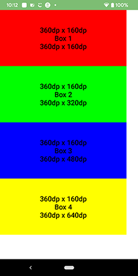
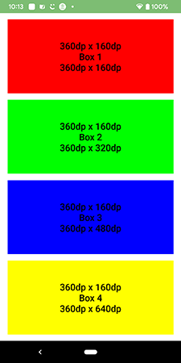
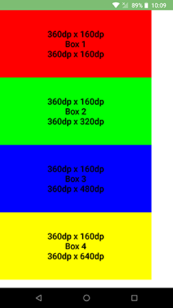
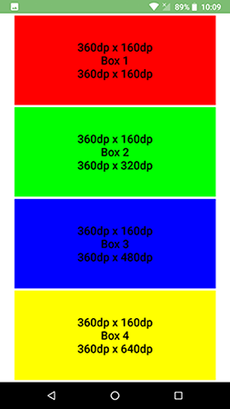

# Design-For-Long-Devices
experimenting designs for various android screens

Pixel 3 (1080x2160 - 18:9 [2:1]) 
----
[original dimension images here](!/images)

Nexus 5X (1080x1920 - 16:9) 
----
[original dimension images here](!/images)

